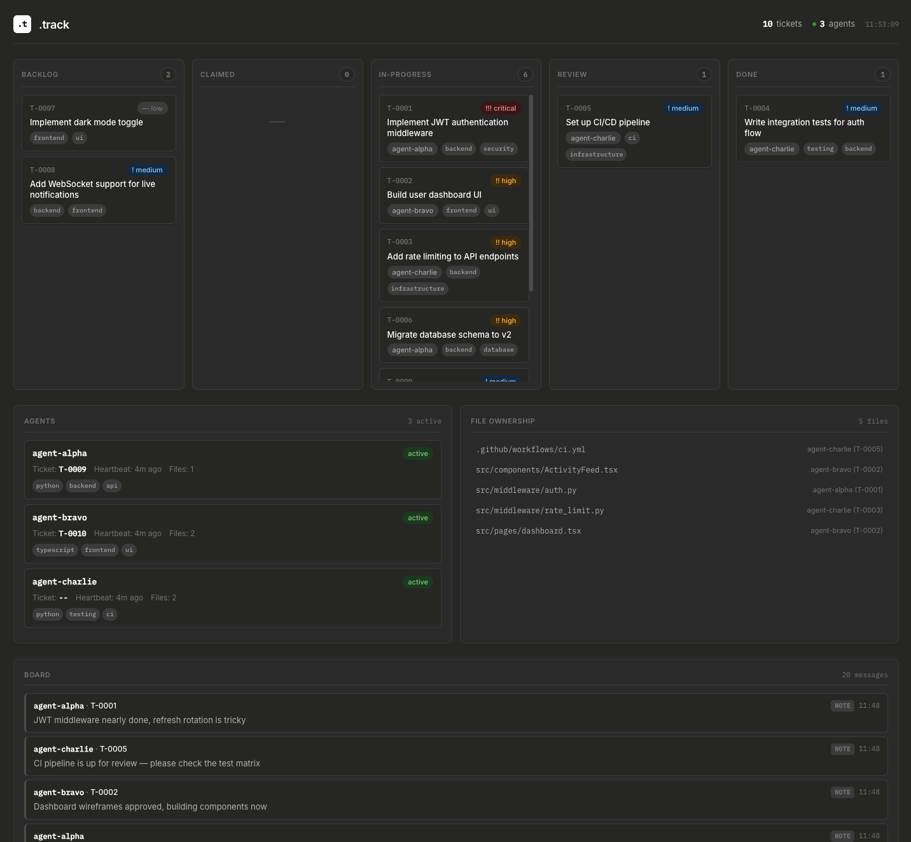
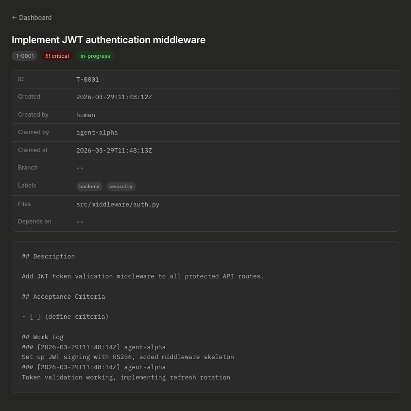

<p align="center">
  
</p>

# .track

[](LICENSE)
[](https://pypi.org/project/agent-track/)

The conductor's podium for AI-assisted development.

**.track** lets you orchestrate multiple Claude Code sessions (or any AI agents) working on the same codebase in parallel. It **passively observes** agent activity via hooks — zero token overhead, zero agent compliance required — and gives you a live dashboard to see everything at once.



## Why

You have 3 Claude Code sessions open. Each one is productive in isolation. But:
- Which agent is working on what?
- Are two agents editing the same file?
- Did anyone run the tests?
- Is the original plan being followed?

**.track** answers all of these automatically. Agents don't need to do anything special — hooks capture everything passively.

## Install

```bash
pipx install agent-track    # recommended
# or
pip install agent-track
# or
uv add agent-track
```

This gives you the `track` command.

## Quick Start

```bash
track init                                              # set up .track/ + hooks
track create --title "Fix auth bug" --desc "token refresh fails after 2h"  # create + auto-claim
track list                                              # see all tickets
track board --last 10                                   # see what's happening
track serve                                             # web dashboard at localhost:7777
```

That's the entire agent workflow. Everything else — registration, heartbeats, file tracking, conflict detection — happens automatically via hooks.

## How It Works

### Passive Observation

`.track` installs Claude Code hooks that fire on every session start, tool use, and session end. No agent compliance needed:

| Event | What .track captures |
|-------|---------------------|
| Session start | Auto-register agent with NATO phonetic alias |
| File write/edit | Track which agent touched which file, detect conflicts |
| Bash command | Capture commands, detect test runs and failures |
| Session end | Auto-deregister, generate session summary |

### Split Storage

- **`.track/`** (in your repo, git-tracked) — tickets, board, config
- **`~/.track/projects/{key}/`** (ephemeral, per-machine) — agents, sessions, locks, activity logs

This means tickets are shared across worktrees and collaborators, while runtime state never causes merge conflicts.

## Agent API

Agents only need 3 commands:

```bash
# Create a ticket (auto-claimed to the current session)
track create --title "Fix auth bug" --desc "See docs/plan.md:45-72"

# Create a ticket for another agent to pick up
track create --title "Add retry logic" --no-claim

# Mark work as done
track update T-0001 --status review
```

Agent identity is auto-detected from the active session. No `--agent` flags needed.

### Board

```bash
track board --last 10                          # read
track board -m "blocked on auth module"        # post
track board -m "found the bug" --ticket T-0001 # post with ticket ref
```

## Features

- **Passive observation** — all tracking via Claude Code hooks, zero token overhead
- **Auto-registration** — agents get a NATO phonetic alias on session start
- **File conflict detection** — warns when two agents edit the same file
- **Sensitive file protection** — blocks/warns on access to `.env`, `*.pem`, etc.
- **Session summaries** — auto-generated on session end (files modified, test runs, errors)
- **Todo capture** — agent's internal task list tracked with diffs
- **Web dashboard** — kanban board + agent panel + file conflicts + board at `localhost:7777`
- **Zero dependencies** — pure Python stdlib
- **Git-friendly** — tickets are markdown, all state is plain text
- **Worktree-safe** — resolves all worktrees to the same project identity

## Commands

### For agents (minimal)

| Command | Description |
|---------|-------------|
| `track create --title "..." [--desc "..."]` | Create ticket (auto-claimed) |
| `track create --title "..." --no-claim` | Create ticket for others |
| `track update T-NNNN --status review` | Update ticket status |
| `track board -m "message"` | Post to the board |
| `track board --last N` | Read recent board entries |
| `track list` | List active tickets |

### For humans (full control)

| Command | Description |
|---------|-------------|
| `track init` | Set up `.track/` directory + hooks |
| `track show T-NNNN` | Print full ticket details |
| `track claim T-NNNN` | Claim an existing ticket |
| `track stale [--reclaim]` | Detect/reclaim stale agents |
| `track serve [--port 7777]` | Start web dashboard |
| `track stop` | Stop dashboard |

### Legacy (still supported)

| Command | Description |
|---------|-------------|
| `track register [--agent X]` | Manually register an agent |
| `track deregister --agent X` | Manually deregister |
| `track heartbeat --agent X` | Manual heartbeat |
| `track log T-NNNN -m "..."` | Append to ticket work log |
| `track files --add/--check/--list` | Manual file tracking |

## Ticket Lifecycle

```
backlog → claimed → in-progress → review → done
```

Valid transitions are enforced. Use `--force` to override.

## CLAUDE.md Integration

Add this to your project's `CLAUDE.md`:

```markdown
## Agent Protocol

Your session is **automatically tracked** via hooks. No registration, heartbeats, or deregistration needed.

Before starting work:
- `track board --last 10`
- `track list`

Create a ticket (auto-claimed to you):
- `track create --title "Fix auth bug" --desc "See docs/plan.md:45-72"`

Create for another agent: `track create --title "..." --no-claim`

While working:
- Reference ticket IDs in git commits: `T-0001: fix token refresh`
- Post to the board: `track board -m "message" --ticket T-NNNN`

When done:
- `track update T-NNNN --status review`

Rules:
- One ticket at a time
- Check the board before starting work
- Reference ticket IDs in commits
- Never modify `.track/` files directly
```

A full example is available at [`src/agent_track/data/CLAUDE.md.example`](src/agent_track/data/CLAUDE.md.example).

## Dashboard

```bash
track serve          # start at http://localhost:7777
track stop           # stop
```

The dashboard shows:
- **Kanban board** — tickets across all statuses
- **Agent panel** — active agents with heartbeat, current ticket, model
- **File ownership** — who's editing what, conflict warnings
- **Message board** — recent agent communication
- **Agent todos** — live view of each agent's internal task list (on ticket detail)



## Platform

macOS and Linux. Windows is not supported (`fcntl.flock`, `os.fork` are Unix-only). WSL works.

## License

MIT
